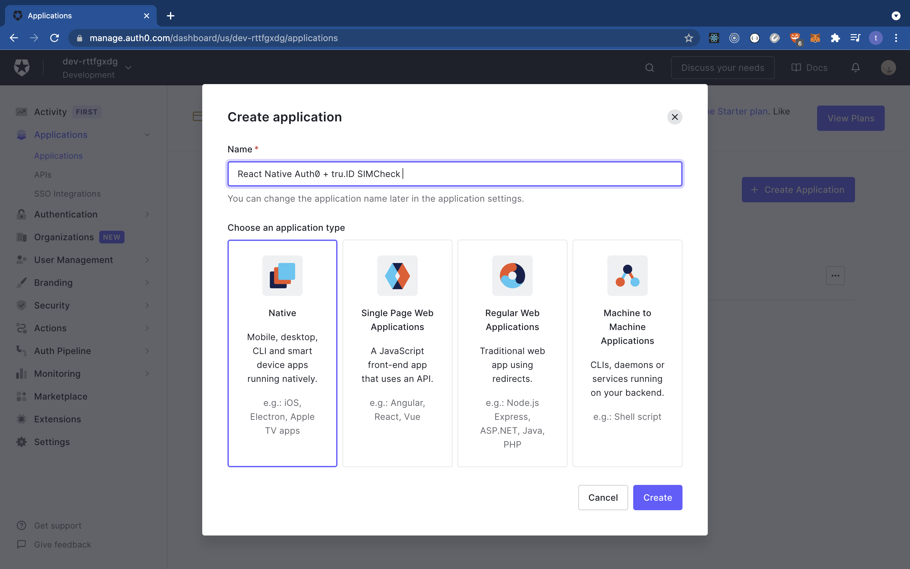
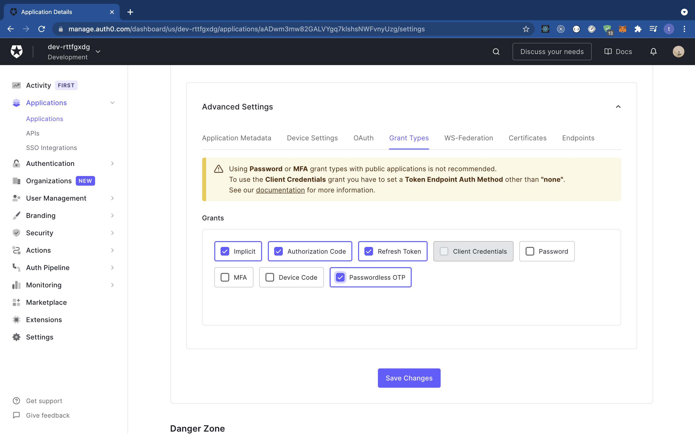
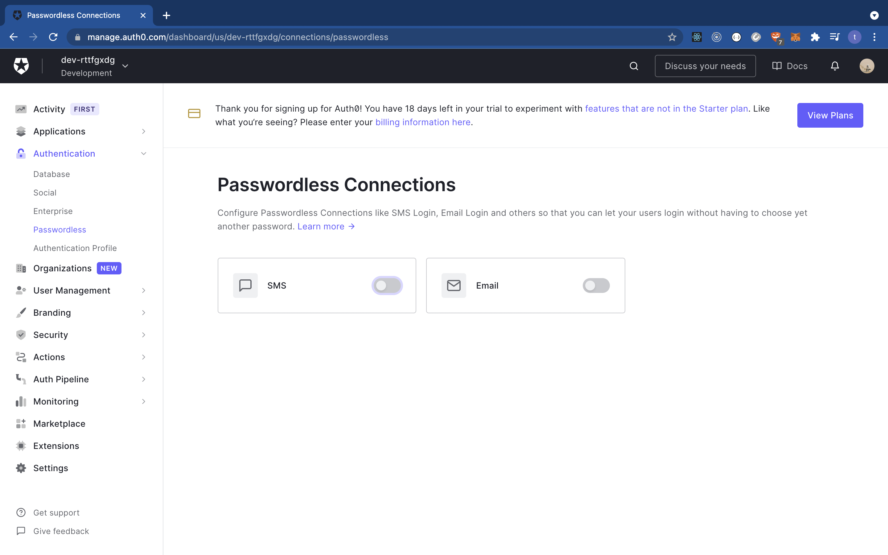

## Passwordless SIM Based Authentication with Auth0 React Native **tru.ID** SIMCheck

## Requirements

- A [tru.ID Account](https://tru.id)
- An [Auth0 Account](https://manage.auth0.com)
- A [Twilio Account](https://www.twilio.com)
- A mobile phone with a SIM card and mobile data connection

## Getting Started

Clone the starter-files branch via:

```bash
git clone -b starter-files --single-branch https://github.com/tru-ID/auth0-passwordless-authentication-react-native.git
```

If you're only interested in the finished code in main then run:

```bash
git clone -b main https://github.com/tru-ID/auth0-passwordless-authentication-react-native.git
```

Create a [tru.ID Account](https://tru.id)

Install the tru.ID CLI via:

```bash
npm i -g @tru_id/cli

```

Input your **tru.ID** credentials which can be found within the tru.ID [console](https://developer.tru.id/console)

Install the **tru.ID** CLI [development server plugin](https://github.com/tru-ID/cli-plugin-dev-server)

Create a new **tru.ID** project within the root directory via:

```
tru projects:create rn-auth0 --project-dir .
```

Run the development server, pointing it to the directory containing the newly created project configuration. This will also open up a localtunnel to your development server making it publicly accessible to the Internet so that your mobile phone can access it when only connected to mobile data.

```
tru server -t
```

## Setting up Auth0

Head over to the Auth0 and [sign in](https://manage.auth0.com). When signed in you'll be redirected to the dashboard as shown below.


To create a new application by clicking on the "applications" pane on the left hand side. This will route you to a new page. Click on the "create application" button to create a new application as shown below.



This will give you `Client ID` and `Client Secret` values.

Next, we need to copy our the values of the `.env.example` to `.env`:

```bash
cp .env.example .env
```

Replace `AUTH0_CLIENT_ID` with the `Client ID` value.

Next, replace `AUTH0_DOMAIN` with the `Domain` value.


## Setting up Passwordless Authentication on Auth0

To set up passwordless authentication on Auth0, first scroll down to "Advanced Settings" > "Grant Types" and select "Passwordless OTP" as shown below. 



Next, hover over the "Authentication" icon (on the dashboard to your left) and click "Passwordless". You should be taken to a screen that looks as follows:



Click on SMS and input the credentials as shown below. Auth0 uses Twilio so ensure to grab the credentials from the [Twilio Console](console.twilio.com)


Once you've set up your Twilio credentials, nagivate to the "Applications" pane and enable your application as shown below:


## Start the project

To start the project, first install dependencies via:

```bash
npm install
```

Ensure you have a physical device connected and run:

```bash
npm run android
#or
npm run ios
```
